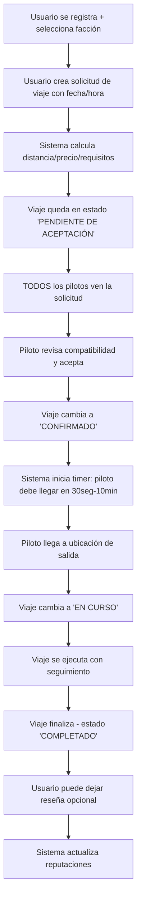
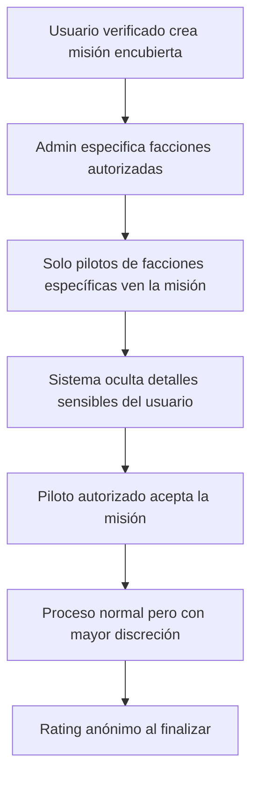
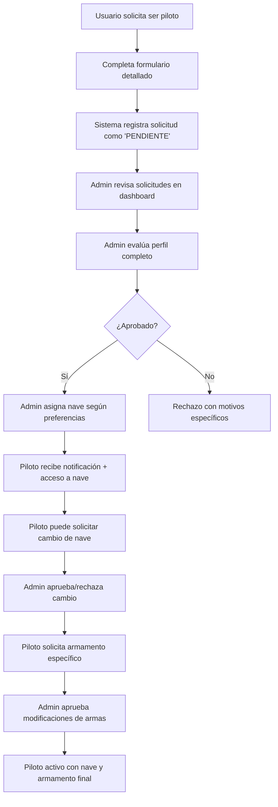

# 📊 ANÁLISIS DE MODELO DE NEGOCIO - FLYSOLO
## Plataforma de Transporte Espacial con Sistema de Facciones

---

**📅 Fecha:** 20 de Septiembre, 2025  
**📋 Analista:** GitHub Copilot  
**🎯 Proyecto:** FlySolo - Trabajo Práctico Universitario  
**📄 Versión:** 1.0  

---

## 🎯 RESUMEN EJECUTIVO

**FlySolo** es una plataforma innovadora de gestión de transporte espacial que opera en el universo Star Wars, conectando usuarios que necesitan transporte (personal o de carga) con pilotos independientes a través de un sistema de matching inteligente similar a Uber, pero con la característica distintiva de operar en un contexto de **guerra civil galáctica** donde las **facciones políticas** determinan el acceso y la visibilidad de los servicios.

### 🌟 **Propuesta de Valor Única**
- **Matching faction-aware**: Los usuarios solo ven servicios compatibles con su afiliación política
- **Misiones encubiertas**: Opción para colaboración cross-faction en situaciones especiales
- **Cálculo automático de distancias**: Sistema 3D que considera sistemas solares y coordenadas planetarias
- **Gestión integral**: Control de naves, armamento, licencias y reputación

---

## 🏛️ MODELO DE NEGOCIO DETALLADO

### **💼 Problema que Resuelve**
En un universo fragmentado por la guerra civil, el transporte espacial está limitado por:
- **Desconfianza entre facciones** - Riesgo de usar servicios del bando enemigo
- **Información fragmentada** - Dificultad para encontrar pilotos confiables
- **Logística compleja** - Cálculo manual de rutas y costos
- **Falta de verificación** - Pilotos no certificados o naves inadecuadas

### **💡 Solución Propuesta**
FlySolo centraliza y automatiza el ecosistema de transporte espacial mediante:
- **Plataforma unificada** con segregación por facciones
- **Verificación automática** de pilotos, licencias y capacidades de nave
- **Sistema de reputación** bidireccional (piloto ↔ pasajero)
- **Cálculo inteligente** de rutas, distancias y precios
- **Gestión completa** de flota y modificaciones

---

## 👥 SEGMENTOS DE MERCADO

### **🚀 LADO DEMANDA: Usuarios Finales**

#### **👨‍💼 Segmento 1: Pasajeros Individuales**
- **Perfil**: Ciudadanos que necesitan transporte personal entre planetas
- **Necesidades**: Transporte seguro, económico y alineado con su facción
- **Comportamiento**: Priorizan reputación del piloto y compatibilidad política
- **Valor**: Tickets individuales de rango medio-alto

#### **📦 Segmento 2: Empresas de Carga**
- **Perfil**: Corporaciones que necesitan transporte de mercancías
- **Necesidades**: Capacidad de carga específica, discreción, confiabilidad
- **Comportamiento**: Contratos recurrentes, sensibles al precio y tiempo
- **Valor**: Contratos de alto valor, volúmenes consistentes

#### **🏢 Segmento 3: Organizaciones**
- **Perfil**: Entidades gubernamentales, ONGs, grupos rebeldes
- **Necesidades**: Transporte de personal, suministros, misiones especiales
- **Comportamiento**: Requieren máxima discreción y lealtad política
- **Valor**: Contratos gubernamentales de alto margen

### **✈️ LADO OFERTA: Pilotos**

#### **👨‍✈️ Segmento 1: Pilotos Profesionales**
- **Perfil**: Ex-militares, pilotos comerciales experimentados
- **Motivación**: Ingresos estables, autonomía laboral
- **Capacidades**: Naves avanzadas, licencias completas
- **Valor**: Alta calidad de servicio, disponibilidad constante

#### **🌟 Segmento 2: Aventureros Independientes**
- **Perfil**: Contrabandistas, mercenarios, freelancers espaciales
- **Motivación**: Flexibilidad, aventura, ingresos variables
- **Capacidades**: Naves modificadas, rutas no convencionales
- **Valor**: Servicios especializados, misiones de alto riesgo

#### **🎓 Segmento 3: Pilotos Novatos**
- **Perfil**: Recién graduados de academias, jóvenes pilotos
- **Motivación**: Experiencia, construcción de reputación
- **Capacidades**: Naves básicas, licencias limitadas
- **Valor**: Precios competitivos, disponibilidad en rutas básicas

### **👑 ADMINISTRADORES**
- **FlySolo Corp**: Operadores de la plataforma
- **Reguladores Galácticos**: Control de cumplimiento normativo
- **Gestores de Flota**: Administración de naves y equipamiento

---

## ⚔️ SISTEMA DE FACCIONES: DIFERENCIADOR CLAVE

### **🎖️ Contexto del Universo**
La aplicación opera durante la **Guerra Civil Galáctica**, creando tres ecosistemas diferenciados:

#### **🔴 IMPERIO GALÁCTICO**
```
Características del Segmento:
• Usuarios que apoyan el régimen imperial
• Priorizan seguridad y eficiencia sobre precio
• Acceso a rutas comerciales principales
• Preferencia por pilotos con registros limpios
• Tolerancia baja al riesgo

Valor para el Negocio:
• Mayor poder adquisitivo promedio
• Contratos de largo plazo
• Volúmenes altos y predecibles
• Menor churn rate
```

#### **🔵 ALIANZA REBELDE**
```
Características del Segmento:
• Usuarios que apoyan la resistencia
• Priorizan discreción y lealtad política
• Necesitan rutas alternativas y discretas
• Red de pilotos comprometidos ideológicamente
• Tolerancia alta al riesgo

Valor para el Negocio:
• Disposición a pagar premium por discreción
• Contratos especializados de alto margen
• Fidelidad extrema a la plataforma
• Referrals orgánicos dentro de la red rebelde
```

#### **⚪ NEUTRALES**
```
Características del Segmento:
• No toman partido en el conflicto
• Priorizan precio y conveniencia
• Flexibilidad para trabajar con cualquier facción
• Segmento más grande pero menos leal
• Tolerancia media al riesgo

Valor para el Negocio:
• Mayor volumen total de usuarios
• Diversificación de riesgo político
• Mercado más competitivo en precios
• Potencial de conversión a facciones específicas
```

---

## 🔄 FLUJOS OPERACIONALES CORREGIDOS

### **FLUJO PRINCIPAL: Solicitud de Viaje Estándar (Corregido)**



**Estados del Viaje:**
- 🟡 **PENDIENTE**: Usuario creó solicitud, esperando piloto
- 🔵 **CONFIRMADO**: Piloto aceptó, debe llegar a punto de partida (si el piloto demora - muestra un cartel avisando)
- 🟢 **EN_CURSO**: Piloto llegó, viaje iniciado
- ✅ **COMPLETADO**: Viaje finalizado exitosamente
- ❌ **CANCELADO**: Cancelado por usuario o piloto

**Tipos de Viaje por Timing:**
```
🚀 VIAJE INMEDIATO:
• Usuario solicita "ahora"
• Timer de llegada: 30 segundos - 5 minutos
• Premium pricing (+20%)

📅 VIAJE PROGRAMADO:
• Usuario especifica fecha/hora futura
• Piloto debe confirmar 30 min antes
• Pricing estándar
```

### **FLUJO ESPECIALIZADO: Misiones Encubiertas (CORREGIDO)**



**Lógica de Visibilidad Corregida:**
```
VIAJES NORMALES:
✅ Visibles para TODOS los pilotos (cualquier facción)
✅ Información completa del usuario disponible
✅ Rating público y transparente

MISIONES ENCUBIERTAS:
🔒 Visibles SOLO para facciones específicas seleccionadas
🔒 Información del usuario parcialmente oculta
🔒 Rating anónimo o sin rating
🔒 Require aprobación de administrador
```

**Casos de Uso de Misiones Encubiertas:**
- 🎯 **Misiones Rebeldes**: Solo pilotos Rebel pueden verlas
- 🎯 **Operaciones Imperiales**: Solo pilotos Imperial autorizados
- 🎯 **Exclusiones**: Imperial NO puede ver misión rebelde y viceversa
- 🎯 **Multi-facción**: Rebelde + Neutral pero NO Imperial

### **FLUJO DE GESTIÓN: Onboarding de Pilotos (CORREGIDO)**



**Formulario de Solicitud de Piloto:**
```json
{
  "datosPersonales": {
    "edad": "25",
    "lugarNacimiento": "Coruscant, Sector Core",
    "faccion": "REBEL",
    "tieneAntecedes": false,
    "detallesAntecedentes": null
  },
  "historialPolitico": {
    "tuvoActividadPolitica": true,
    "detalleActividad": "Miembro de célula rebelde en Alderaan",
    "añosActividad": "2019-2022"
  },
  "preferenciasLaborales": {
    "tipoViajesPreferido": "CARGA", // PASAJEROS, CARGA, MIXTO
    "distanciasPreferidas": "CORTAS", // CORTAS, MEDIAS, LARGAS, CUALQUIERA  
    "disponibilidadHoraria": "24/7",
    "comentariosAdicionales": "Experiencia previa en contrabando"
  },
  "experienciaPilotaje": {
    "añosExperiencia": 8,
    "tiposNavesManejadas": ["Freighter ligero", "Fighter X-Wing"],
    "licenciasActuales": ["Piloto Comercial", "Transporte de Carga"],
    "referencias": "Han Solo - Contacto disponible"
  }
}
```

**Criterios de Evaluación del Admin:**
```
FACTORES DE APROBACIÓN:
🟢 Edad: 18-65 años
🟢 Licencias válidas y vigentes
🟢 Sin antecedentes penales graves
🟢 Referencias verificables
🟡 Actividad política: Evaluación caso por caso
🔴 Antecedentes de tráfico o piratería: Rechazo automático

ASIGNACIÓN DE NAVE:
• Preferencia CARGA → Freighter (YT-1300, YT-2400)
• Preferencia PASAJEROS → Transport (Lambda Shuttle, Consular)
• Experiencia FIGHTER → Interceptor (A-Wing, TIE Fighter)
• NOVATO → Nave básica (Z-95 Headhunter)
```